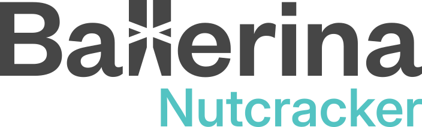

<div align="center">

<picture>
  <source media="(prefers-color-scheme: dark)" srcset="doc/img/logo-dark.svg" width="300">
  <source media="(prefers-color-scheme: light)" srcset="doc/img/logo-light.svg" width="300">
  
</picture>

**A native interpreter for the Ballerina programming language.**

[](https://github.com/ballerina-nutcracker/ballerina/releases)
[](https://github.com/ballerina-nutcracker/ballerina/actions/workflows/native-ci.yml)
[](https://codecov.io/gh/ballerina-nutcracker/ballerina)
[](https://opensource.org/licenses/Apache-2.0)
[](https://discord.gg/ballerinalang)

[Website](https://ballerina.io) &nbsp;·&nbsp;
[Playground](https://play.ballerina.io/) &nbsp;·&nbsp;
[Language spec](https://github.com/ballerina-platform/ballerina-spec) &nbsp;·&nbsp;
[Developing](doc/guides/DEVELOPING.md) &nbsp;·&nbsp;
[Architecture](doc/guides/ARCHITECTURE.md) &nbsp;·&nbsp;
[Roadmap](https://github.com/ballerina-nutcracker/ballerina/milestones)

</div>

---

[Ballerina](https://ballerina.io) is an open-source, cloud-native programming language optimized for integration, with built-in support for JSON and XML, first-class constructs for services and concurrency, and structural typing. It is developed and supported by [WSO2](https://wso2.com) and the wider Ballerina community. Try the language in your browser on the [Ballerina Playground](https://play.ballerina.io/).

**Ballerina Nutcracker** compiles Ballerina source to **Ballerina Intermediate Representation (BIR)** and interprets the BIR directly. Written in Go, it ships as one `bal` binary — no separate runtime, nothing to warm up — which keeps startup fast and the footprint small for short-lived cloud-native workloads such as CLIs, functions, and sidecars.

> [!IMPORTANT]
> Nutcracker is under active development and does not yet support the whole language. For production use today, reach for [Ballerina Swan Lake](https://ballerina.io/downloads/) — the official distribution, which supports the full language.

## Architecture


Almost everything that ships in the `bal` binary is a Go package. The central cache, the local repository, the host OS, and the browser sit outside it. See [ARCHITECTURE.md](doc/guides/ARCHITECTURE.md) for how the diagram maps onto source directories.

## Getting started

Download a binary from the [latest release](https://github.com/ballerina-nutcracker/ballerina/releases), or build from source with [Go 1.26 or later](https://go.dev/dl/):

```bash
git clone https://github.com/ballerina-nutcracker/ballerina.git
cd ballerina
go build -o bal ./cli/cmd
```

Create and run your first program:

```bash
./bal new hello
./bal run hello
```

```ballerina
import ballerina/io;

public function main() {
    io:println("Hello, World!");
}
```

| Command | Description |
| --- | --- |
| `bal new <path>` | Create a new package (`-t <template>`, `--workspace`) |
| `bal run <file.bal> \| <package-dir> \| .` | Compile and execute a source file or package |
| `bal pack [<package-dir>]` | Build the `.bala` distribution archive of a package |
| `bal build [<package-dir>]` | Build a standalone executable that bundles the Ballerina runtime |
| `bal push [<bala-path>] --repository=local` | Push a `.bala` of the current package (or a given archive) to the local repository |
| `bal version` | Print the version |

`bal build` needs a `balrt` stripped-down runtime alongside `bal` (`go build -o balrt ./cli/internal/balrt`), or pointed at via the `main.RuntimeStubPath` link-time override.

For debugging flags, profiling, testing, and linting, see [DEVELOPING.md](doc/guides/DEVELOPING.md).

## Scope & roadmap

Development is organized by **subsets** of the Ballerina language; each milestone adds support for a defined subset.

- **Progress:** [GitHub Milestones](https://github.com/ballerina-nutcracker/ballerina/milestones)
- **Supported language features:** [`doc/lang`](doc/lang)
- **Supported library features:** [`doc/library`](doc/library)

## Contributing

Contributions are welcome — read the [contribution guidelines](CONTRIBUTING.md) to get started, and the [code of conduct](CODE_OF_CONDUCT.md) before you take part.

- **Found a bug or want a feature?** Search [existing issues](https://github.com/ballerina-nutcracker/ballerina/issues), then open a new one.
- **New here?** Start with issues labelled [`good first issue`](https://github.com/ballerina-nutcracker/ballerina/labels/good%20first%20issue).
- **Found a security vulnerability?** Do not open an issue. Email [security@ballerina.io](mailto:security@ballerina.io) — see the [security policy](SECURITY.md).

## Community

Questions and ideas belong in [GitHub Discussions](https://github.com/ballerina-nutcracker/ballerina/discussions) or on [Discord](https://discord.gg/ballerinalang) — Discord is where the team is most active. See [ballerina.io/community](https://ballerina.io/community/) for everything else.

## License

Distributed under the [Apache License 2.0](LICENSE).
